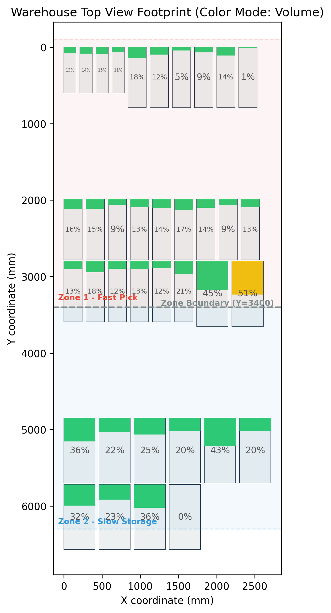
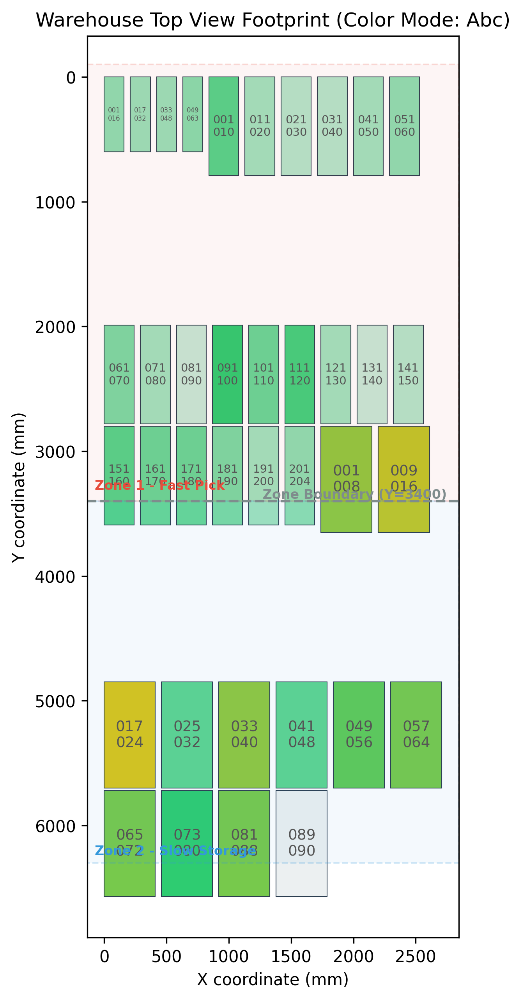
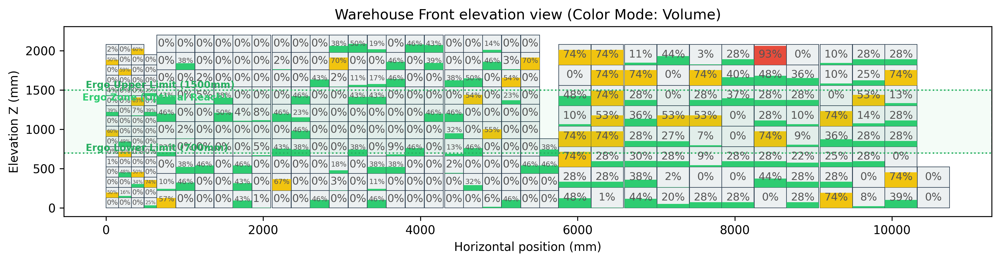
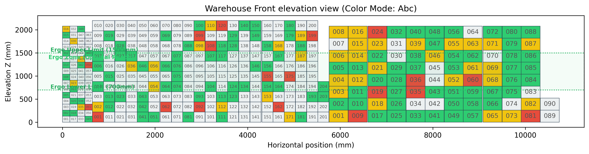
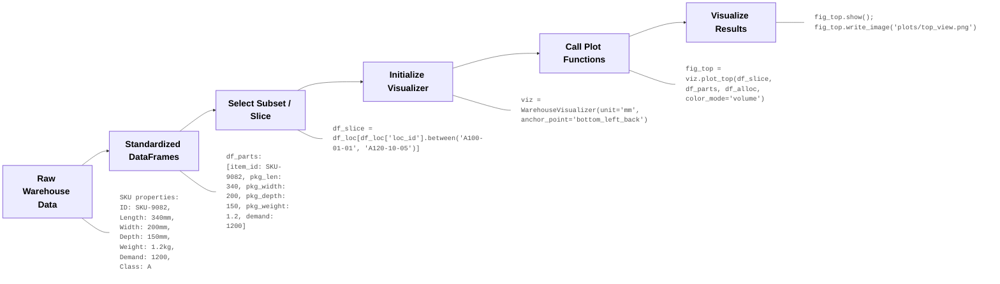

# `ware-viz` (Warehouse Layout Visualization Library)

`ware-viz` is a lightweight, pure Python visualization library designed for engineers and researchers analyzing and/or optimizing warehouse slotting. It renders 2D layout diagrams (Top footprint views and Front elevation views) of inventory allocations, showing demand heatmaps, ABC analysis classes, volumetric fills, and package weight distributions to track storage and picking efficiency within user-defined constraints.

### Top Footprint Views
<div style="display: flex; gap: 10px; justify-content: center; margin-bottom: 15px;">
  
  
</div>

### Front Elevation Views (Sequential Corridors)



---

## Visual Pipeline & Workflow

The library expects clean, standardized DataFrames. Slicing, filtering, and database queries are performed outside the library before passing the clean subsets to the visualizer. 

The recommended use is to run the visualizer in between optimization rounds of your slotting algorithm to visually inspect the slotting changes, or to compare different configurations at the end of a design cycle.

### Data Preparation and Visualization Flow



---

## Quick Start

```python
import pandas as pd
from ware_viz import WarehouseVisualizer

# 1. Load your pre-processed datasets
df_loc = pd.read_csv("data/locations.csv")
df_parts = pd.read_csv("data/parts.csv")
df_alloc = pd.read_csv("data/allocations.csv")

# 2. Initialize the visualizer
# Supported units: 'mm', 'cm', 'in', etc.
# Supported anchors: 'bottom_left_back', 'center'
viz = WarehouseVisualizer(unit="mm", anchor_point="bottom_left_back")

# 3. Render Top View Footprint with labeling, custom zones, and boundary lines (returns a Plotly Figure)
top_areas = [
    dict(x0=None, x1=None, y0=-100, y1=3400, label="Zone 1 - Fast Pick", 
         fill_color="rgba(231, 76, 60, 0.05)", border_color="rgba(231, 76, 60, 0.2)", border_style="--")
]
top_lines = [
    dict(coordinate=3400, axis="y", label="Zone Boundary (Y=3400)", color="#7f8c8d")
]
fig_top = viz.plot_top(df_loc, df_parts, df_alloc, color_mode="volume", show_labels=True, 
                       label_content="indicator", dotted_lines=top_lines, custom_areas=top_areas)
fig_top.show()

# 4. Filter for Aisle A2 subset and render Front elevation with address labels and ergo zone
front_areas = [
    dict(x0=None, x1=None, y0=700, y1=1500, label="Ergo Zone", 
         fill_color="rgba(46, 204, 113, 0.05)", border_color="rgba(46, 204, 113, 0.2)", border_style="--")
]
df_aisle = df_loc[(df_loc['loc_id'].str.startswith('A2')) & (df_loc['pos_y'] <= 1990.0)]
fig_front = viz.plot_front(df_aisle, df_parts, df_alloc, color_mode="abc", show_labels=True, 
                           label_content="address", custom_areas=front_areas)
fig_front.show()
```

---

## Standardized Schemas

The library expects DataFrames matching the schemas below:

### 1. Locations Dataset
Contains physical boundaries and 3D positioning.
*   `loc_id` (str): Unique slot identifier.
*   `pos_x` (float): X coordinate (horizontal positioning).
*   `pos_y` (float): Y coordinate (depth positioning).
*   `pos_z` (float): Z coordinate (shelf level elevation).
*   `loc_width` (float): Physical slot width.
*   `loc_depth` (float): Physical slot depth.
*   `loc_height` (float): Physical slot height.

*Note: By default, `(pos_x, pos_y, pos_z)` represent the bottom-left-back corner (minimum boundaries) of the slot in 3D space. This can be configured to represent the center on initialization.*

### 2. Parts Dataset
Defines packaging properties and demand metrics.
*   `item_id` (str/int): Unique SKU ID.
*   `pkg_len` (float): Package length.
*   `pkg_width` (float): Package width.
*   `pkg_depth` (float): Package depth.
*   `pkg_weight` (float): Package weight.
*   `items_per_pkg` (int): Items per package.
*   `demand` (float, optional): Annual item-level demand in units.
*   `abc_class` (str, optional): ABC slotting class (`'A'`, `'B'`, `'C'`).

### 3. Allocations Dataset
Maps SKUs to their physical slots.
*   `loc_id` (str): Slot ID.
*   `item_id` (str/int): SKU ID.
*   `alloc_qty` (int): Quantity of packages stored.

---

## Visual Rendering Rules

### Mixed Storage (Multi-SKU Bins)
When a slot stores multiple items, attributes are aggregated inside the library:
*   **Occupied Volume:** Calculated as `sum(alloc_qty * pkg_len * pkg_width * pkg_depth)` across all allocated items in the bin.
*   **Total Weight:** Calculated as `sum(alloc_qty * pkg_weight)`.
*   **Pick Trips:** Calculated as `sum(demand / items_per_pkg)` to represent actual visits to the location.
*   **ABC Class:** Resolved by taking the highest priority SKU (`A` > `B` > `C` > `Empty`).

### 2D Footprint Generation (Top View)
*   **Rectangle Layout:** The spatial coordinates `(pos_x, pos_y)` represent the bottom-left corner of the slot's footprint. The footprint is drawn as a rectangle from `pos_x` to `pos_x + loc_width` horizontally, and from `pos_y` to `pos_y + loc_depth` vertically.
*   **Vertical Axis Inversion:** To ensure proper visual layout where positive Y represents depth extending downward and positive X represents length extending rightward from a top-left origin `(0, 0)`, the vertical axis of the Top View plot is inverted (`autorange="reversed"` in Plotly, and `ax.invert_yaxis()` in Matplotlib).
*   **Overlap Prevention:** To prevent visual overlap from stacked levels in the top view, layout data is collapsed to unique `(pos_x, pos_y)` footprints.
    *   *Continuous variables* (volume fill, weight, demand, trips) are calculated as the **average** of all bins sharing that `(pos_x, pos_y)` stack.
    *   *ABC Class* is averaged by converting classes to numerical weights (`A=3, B=2, C=1, Empty=0`), taking the mean, and mapping the resulting average back to a continuous color gradient from C to A.

### 2D Sequential Elevation Generation (Front View)
*   **Corridor Orientation Detection:** The visualizer automatically detects the corridor length axis by comparing the median spacing gaps of adjacent unique coordinates along X and Y. The axis with the smaller median spacing represents the corridor length axis (`horiz_col`), and the axis with the larger median spacing represents the across-corridor depth axis (`depth_col`).
*   **Layout Flattening & Sequential Accumulation:** Instead of plotting coordinates on a global grid (which would overlay corridors behind one another), the layout is flattened into a sequential side-by-side elevation profile of vertical stacks.
    1. Stacks are grouped by their unique `(pos_x, pos_y)` coordinates.
    2. Stacks are sorted by `depth_col` (corridor) first to group corridors together, then by `horiz_col` (position along the corridor), and levels are sorted by `pos_z` vertically.
    3. A horizontal accumulator `cursor_x` is initialized at 0.
    4. For each stack, shelf slots are drawn using `(cursor_x, pos_z)` as the bottom-left anchor point, extending horizontally by `loc_width` and vertically by `loc_height`.
    5. After drawing all levels in a stack, `cursor_x` is incremented by adding the slot's width plus a small stack gap (`seq_gap`, default `2.0`).
    6. When transitioning to a new corridor, a larger corridor gap (`corridor_gap`, default `15.0`) is added to `cursor_x` to visually isolate the corridors.
*   **Elevation Axis:** The vertical axis represents elevation directly, meaning ground level `pos_z = 0` starts at the bottom.

### Text Labeling & Indicators inside Location Rectangles
To display text overlays directly inside each location box:
*   **Enable labeling** by setting `show_labels=True`.
*   **Configure content** using `label_content`:
    *   `"indicator"` (default): Displays the numeric or percentage value matching the active `color_mode` (Volume %, total demand, total trips, or total weight). In `abc` class mode, this automatically falls back to showing the address range.
    *   `"address"`: Displays the end portion of the location ID (e.g., `001` to `999` using the last 3 characters, or a collapsed vertical stack range in top view like `001\n016`).
*   *Note: Displaying both the address and indicator simultaneously is not supported due to the compact physical dimensions of the shelf slots.*
*   **Auto-sizing Text:** Font sizes are dynamically calculated in real-time (down to `1pt` if necessary) to fit the physical text boundaries of each location box without overlapping or overflowing.

### Custom Overlays (Dotted Lines & Translucent Areas)
To support plotting standard guidelines (like optimal reach ergonomic zones or custom warehouse picking zones), both `plot_top` and `plot_front` support custom boundary lines and translucent area overlays.

#### 1. Dotted Lines (`dotted_lines` list of dict)
Overlay straight lines across the entire chart. Each line definition is a dictionary:
*   `coordinate` (float): Position along the specified axis.
*   `axis` (str): `'x'` or `'y'` (default `'x'`).
*   `label` (str, optional): A text label drawn next to the line.
*   `color` (str, optional): Line and text color (default `'#7f8c8d'`).
*   `linestyle` (str, optional): Line style, e.g., `'--'` (dashed), `':'` (dotted), `'-'` (solid) (default `'--'`).
*   `linewidth` (float, optional): Line thickness (default `1.5`).
*   `label_align` (str, optional): Label alignment position. For X-axis lines: `'top'` or `'bottom'`. For Y-axis lines: `'left'` or `'right'`.

#### 2. Translucent Areas (`custom_areas` list of dict)
Overlay translucent rectangular shapes. Useful for highlighting zones (e.g., bulk vs. pick zones, ergonomic heights). Each area definition is a dictionary:
*   `x0`, `x1`, `y0`, `y1` (float, optional): The boundary coordinates in physical units. If `None` or omitted, the area dynamically extends to the current plot boundaries.
*   `label` (str, optional): A text label drawn inside the area.
*   `fill_color` (str, optional): Translucent fill color supporting HTML/hex or `rgba(r,g,b,a)` syntax (default `'rgba(52, 152, 219, 0.1)'`).
*   `border_color` (str, optional): Border color. Use `'none'` to omit (default `'rgba(52, 152, 219, 0.3)'`).
*   `border_style` (str, optional): Border style, e.g., `'-'`, `'--'`, `':'` (default `'-'`).
*   `border_width` (float, optional): Border thickness (default `1.0`).
*   `label_align` (str, optional): Label alignment position: `'top_left'`, `'top_right'`, `'bottom_left'`, `'bottom_right'`, or `'center'` (default `'center'`).

---

## Demo Run

A sample script is provided in the repository to demonstrate the visualizer's capabilities on a validated prototype dataset. 

To run the demo:
```bash
python demo.py
```

**What the Demo Does:**
1.  Loads pre-processed locations, parts, and allocations datasets from the `data/` folder.
2.  Initializes a `WarehouseVisualizer` instance.
3.  Generates and exports 11 visualization plots (full range of color modes and labeling possibilities) to a newly created `plot_samples/` folder:
    *   `top_view_[volume/demand/trips/weight/abc].png`: Footprint views for each metric.
    *   `front_view_[volume/demand/trips/weight/abc].png`: Vertical elevation views for the full warehouse layout.
    *   `front_view_address.png`: Vertical elevation view with physical location addresses instead of metrics.

---

## Testing

The library includes an automated test suite implemented with `pytest` to verify dataset loading, coordinates anchoring, 2D collapsing, and figure rendering.

To run the test suite:
```bash
# 1. Install pytest if not already installed:
pip install pytest

# 2. Run the tests:
pytest tests/
```

**What is Tested:**
*   `test_visualizer_initialization`: Checks that visualizer configurations (units, coordinate anchoring) are validated correctly.
*   `test_plot_top_plotly` & `test_plot_top_matplotlib`: Verifies that top footprint views are generated correctly for both Plotly and Matplotlib engines.
*   `test_plot_front_plotly` & `test_plot_front_matplotlib`: Verifies that front elevation views are generated correctly for both Plotly and Matplotlib engines.
