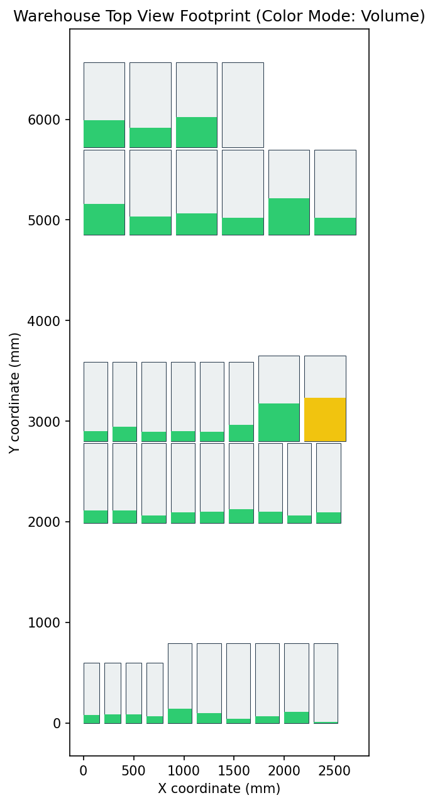
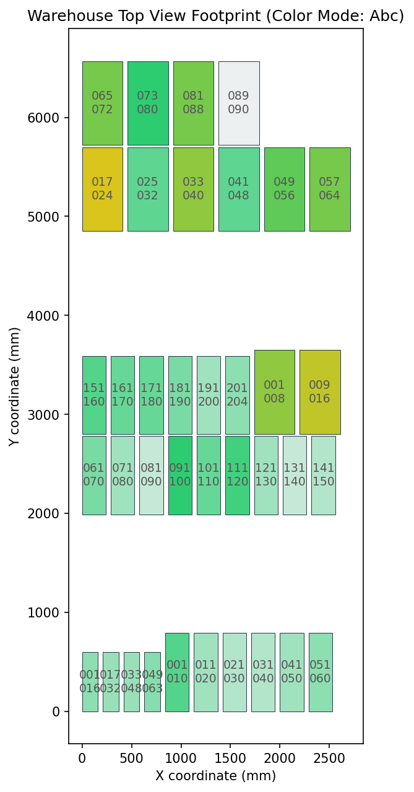
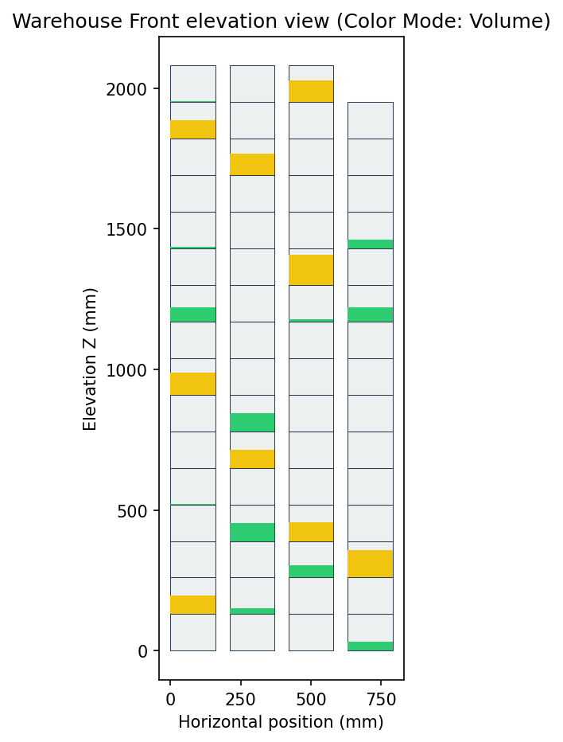
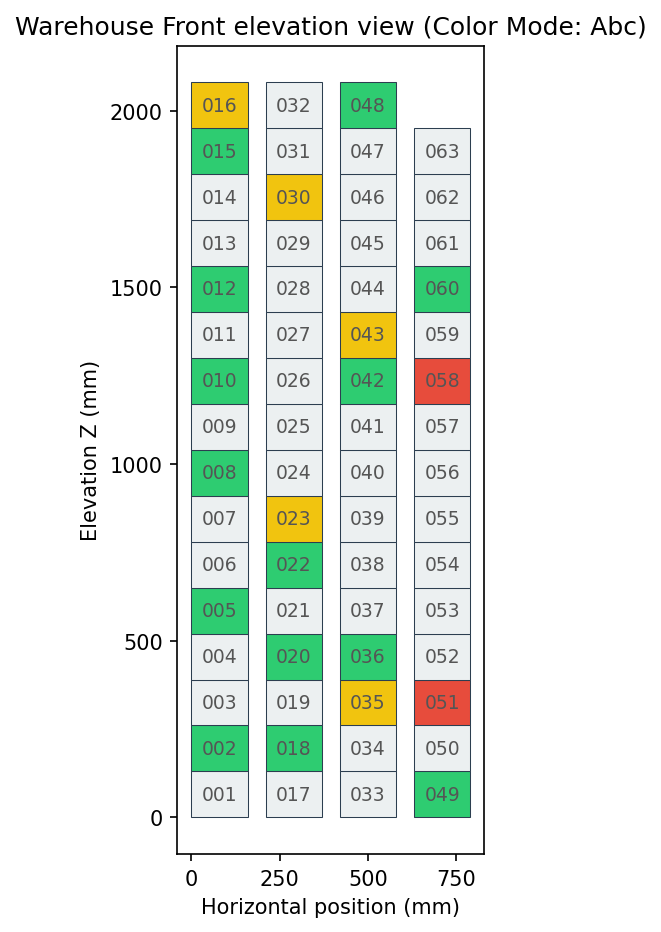
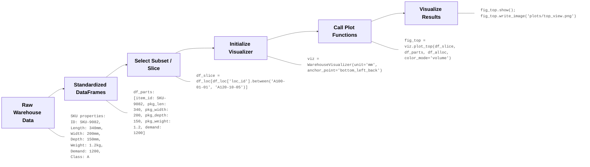

# `ware-viz` (Warehouse Layout Visualization Library)

`ware-viz` is a lightweight, pure Python visualization library designed for engineers and researchers analyzing and/or optimizing warehouse slotting. It renders 2D layout diagrams (Top footprint views and Front elevation views) of inventory allocations, showing demand heatmaps, ABC analysis classes, volumetric fills, and package weight distributions to track storage and picking efficiency within user-defined constraints.

<div style="display: flex; gap: 8px; flex-wrap: nowrap; overflow-x: auto; padding-bottom: 10px; margin-top: 15px; justify-content: center;">
  
  
  
  
</div>

---

## Visual Pipeline & Workflow

The library expects clean, standardized DataFrames. Slicing, filtering, and database queries are performed outside the library before passing the clean subsets to the visualizer. 

The recommended use is to run the visualizer in between optimization rounds of your slotting algorithm to visually inspect the slotting changes, or to compare different configurations at the end of a design cycle.

### Data Preparation and Visualization Flow



---

## Quick Start

```python
import pandas as pd
from ware_viz import WarehouseVisualizer

# 1. Load your pre-processed datasets
df_loc = pd.read_csv("data/locations.csv")
df_parts = pd.read_csv("data/parts.csv")
df_alloc = pd.read_csv("data/allocations.csv")

# 2. Initialize the visualizer
# Supported units: 'mm', 'cm', 'in', etc.
# Supported anchors: 'bottom_left_back', 'center'
viz = WarehouseVisualizer(unit="mm", anchor_point="bottom_left_back")

# 3. Render Top View Footprint with labeling (returns a Plotly Figure)
fig_top = viz.plot_top(df_loc, df_parts, df_alloc, color_mode="volume", show_labels=True, label_content="indicator")
fig_top.show()

# 4. Filter for Aisle A1 and render Front elevation with both address and indicator
df_aisle = df_loc[df_loc['loc_id'].str.startswith('A1')]
fig_front = viz.plot_front(df_aisle, df_parts, df_alloc, color_mode="abc", show_labels=True, label_content="address")
fig_front.show()
```

---

## Standardized Schemas

The library expects DataFrames matching the schemas below:

### 1. Locations Dataset
Contains physical boundaries and 3D positioning.
*   `loc_id` (str): Unique slot identifier.
*   `pos_x` (float): X coordinate (horizontal positioning).
*   `pos_y` (float): Y coordinate (depth positioning).
*   `pos_z` (float): Z coordinate (shelf level elevation).
*   `loc_width` (float): Physical slot width.
*   `loc_depth` (float): Physical slot depth.
*   `loc_height` (float): Physical slot height.

*Note: By default, `(pos_x, pos_y, pos_z)` represent the bottom-left-back corner (minimum boundaries) of the slot in 3D space. This can be configured to represent the center on initialization.*

### 2. Parts Dataset
Defines packaging properties and demand metrics.
*   `item_id` (str/int): Unique SKU ID.
*   `pkg_len` (float): Package length.
*   `pkg_width` (float): Package width.
*   `pkg_depth` (float): Package depth.
*   `pkg_weight` (float): Package weight.
*   `items_per_pkg` (int): Items per package.
*   `demand` (float, optional): Annual item-level demand in units.
*   `abc_class` (str, optional): ABC slotting class (`'A'`, `'B'`, `'C'`).

### 3. Allocations Dataset
Maps SKUs to their physical slots.
*   `loc_id` (str): Slot ID.
*   `item_id` (str/int): SKU ID.
*   `alloc_qty` (int): Quantity of packages stored.

---

## Visual Rendering Rules

### Mixed Storage (Multi-SKU Bins)
When a slot stores multiple items, attributes are aggregated inside the library:
*   **Occupied Volume:** Calculated as `sum(alloc_qty * pkg_len * pkg_width * pkg_depth)` across all allocated items in the bin.
*   **Total Weight:** Calculated as `sum(alloc_qty * pkg_weight)`.
*   **Pick Trips:** Calculated as `sum(demand / items_per_pkg)` to represent actual visits to the location.
*   **ABC Class:** Resolved by taking the highest priority SKU (`A` > `B` > `C` > `Empty`).

### 2D Footprint Aggregation (Top View)
When collapsing the vertical Z-axis to show a 2D top footprint:
*   **Continuous variables** (volume fill, weight, demand, trips) are calculated as the **average** of all bins sharing the same `(pos_x, pos_y)` coordinate.
*   **ABC Class** is averaged by converting classes to numerical weights (`A=3, B=2, C=1, Empty=0`), taking the mean, and mapping the resulting average back to a continuous color gradient from C to A.

### Text Labeling & Indicators inside Location Rectangles
To display text overlays directly inside each location box:
*   **Enable labeling** by setting `show_labels=True`.
*   **Configure content** using `label_content`:
    *   `"indicator"` (default): Displays the numeric or percentage value matching the active `color_mode` (Volume %, total demand, total trips, or total weight). In `abc` class mode, this automatically falls back to showing the address range.
    *   `"address"`: Displays the end portion of the location ID (e.g., `00001` or a collapsed vertical stack range like `00001-16`).
    *   `"both"`: Displays both the address and the indicator on separate lines.
*   **Auto-sizing Text**: Font sizes are dynamically calculated in real-time to fit the physical text boundaries of the rectangle without overlapping.


---

## Demo Run

A sample script is provided in the repository to demonstrate the visualizer's capabilities on a validated prototype dataset. 

To run the demo:
```bash
python demo.py
```

**What the Demo Does:**
1.  Loads pre-processed locations, parts, and allocations datasets from the `data/` folder.
2.  Initializes a `WarehouseVisualizer` instance.
3.  Generates and exports 4 visualization plots to a newly created `plots/` folder:
    *   `top_view_volume_utilization.png`: A footprint view showing average volumetric occupancy.
    *   `top_view_abc_heatmap.png`: A footprint view showing averaged ABC class categories.
    *   `front_view_aisle_a1_volume.png`: A vertical rack elevation view of Aisle A1 showing proportional volume fill.
    *   `front_view_aisle_a1_abc.png`: A vertical rack elevation view of Aisle A1 showing full-box ABC classes.

---

## Testing

The library includes an automated test suite implemented with `pytest` to verify dataset loading, coordinates anchoring, 2D collapsing, and figure rendering.

To run the test suite:
```bash
# 1. Install pytest if not already installed:
pip install pytest

# 2. Run the tests:
pytest tests/
```

**What is Tested:**
*   `test_visualizer_initialization`: Checks that visualizer configurations (units, coordinate anchoring) are validated correctly.
*   `test_plot_top_plotly` & `test_plot_top_matplotlib`: Verifies that top footprint views are generated correctly for both Plotly and Matplotlib engines.
*   `test_plot_front_plotly` & `test_plot_front_matplotlib`: Verifies that front elevation views are generated correctly for both Plotly and Matplotlib engines.
